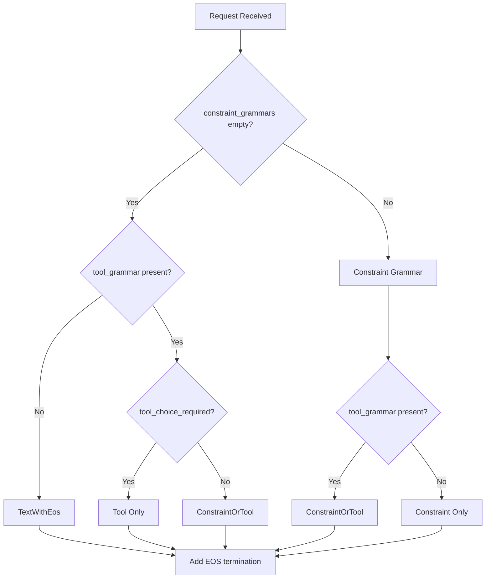
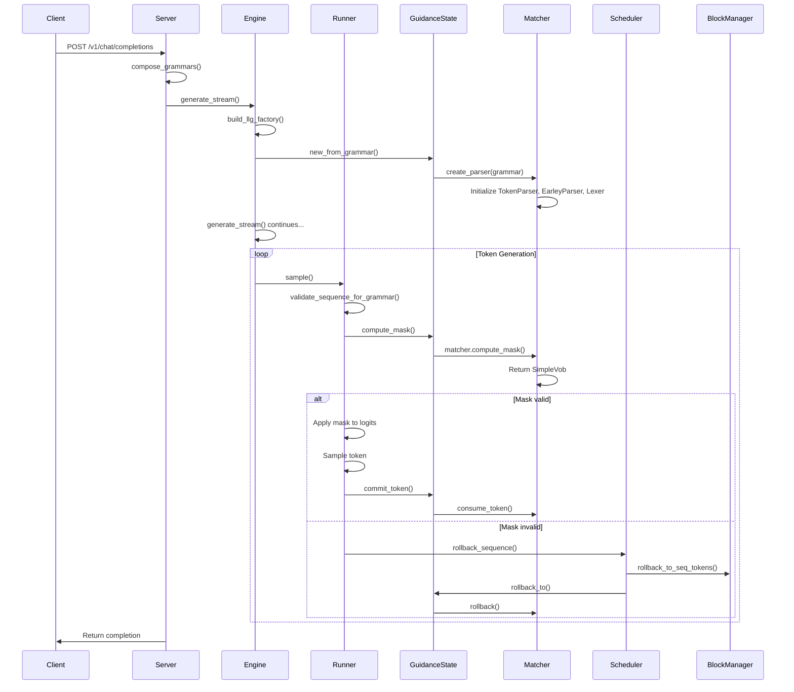

# LLGuidance Integration Documentation

## Overview

This document provides comprehensive documentation for the llguidance integration in vllm.rs, covering:

1. **Architecture** - System design and component interactions
2. **Data Flow** - Complete request-to-response flow
3. **API Reference** - All public functions and their signatures
4. **Usage Examples** - Common patterns and use cases
5. **Mathematical Foundations** - How the grammar system works
6. **Rollback Mechanics** - State recovery and consistency
7. **Grammar Construction** - How grammars are composed and merged
8. **Grammar Rule Order** - Correct ordering of Lark grammar rules

---

## 1. ARCHITECTURE

### Component Overview

```mermaid
sequenceDiagram
    participant User
    participant API
    participant Pipeline
    participant SpecialTokens
    participant LLGFactory
    participant Matcher
    participant TokenParser
    participant EarleyParser
    participant Lexer
    participant TokTrie
    participant Sampler
    participant LogitsProcessor
    participant Model

    User->>API: Request with constraint (regex/json_schema/lark/llguidance)

    Note over User,API: Phase 1: Request Setup and Grammar Building

    API->>SpecialTokens: SpecialTokens::new(&tokenizer)
    SpecialTokens-->>API: Return EOS, BOS, TOOL token IDs
    API->>Pipeline: build_llg_factory(tokenizer)
    Pipeline->>LLGFactory: toktrie_hf_tokenizers::ByteTokenizer::from_tokenizer(tokenizer)
    LLGFactory->>TokTrie: Create token trie from tokenizer vocabulary
    TokTrie-->>LLGFactory: Return TokEnv with trie
    LLGFactory->>LLGFactory: ParserFactory::new_simple(&env)
    LLGFactory-->>Pipeline: Return Arc<ParserFactory>

    Pipeline->>Pipeline: llg_grammar_from_constraint(&request.constraint)
    Pipeline->>Matcher: constraint_from_llg_grammar(&factory, grm)
    Matcher->>Matcher: factory.create_parser(grm)
    Matcher->>TokenParser: Create with grammar_init
    TokenParser->>EarleyParser: Build CGrammar from grammar
    TokenParser->>Lexer: Build LexerSpec from grammar
    Lexer->>TokTrie: Precompute large lexemes if needed
    TokTrie-->>Lexer: Return optimized lexeme sets

    Note over User,Matcher: Phase 2: Prompt Processing (if needed)

    User->>API: Optional: process_prompt(prompt_tokens)
    API->>TokenParser: process_prompt(prompt_tokens)
    TokenParser->>TokenParser: tokenize_bytes_marker(&prompt_bytes)
    TokenParser->>TokenParser: process_prompt() returns new prompt

    Note over User,Matcher: Phase 3: Inference Loop

    loop for each token generation

    Model->>Model: Forward pass on input tokens
    Model-->>Pipeline: Return logits tensor

    Pipeline->>Sampler: sample_sequence(logits, seq, ...)

    Note over Sampler: Two-stage sampling with llguidance

    Sampler->>LogitsProcessor: Apply llguidance constraint

    LogitsProcessor->>TokenParser: compute_mask()
    TokenParser->>TokenParser: compute_mask_inner()
    TokenParser->>EarleyParser: run_speculative("compute_mask")
    EarleyParser->>EarleyParser: trie_started("compute_mask")
    EarleyParser->>EarleyParser: compute_bias()
    EarleyParser->>Lexer: compute_bias() with token_prefix

    Note over Lexer,TokTrie: Lexical Scope Analysis

    Lexer->>TokTrie: Walk token trie for allowed lexemes
    TokTrie-->>Lexer: Return SimpleVob bit mask

    Lexer->>EarleyParser: Return mask to TokenParser
    TokenParser->>TokenParser: cache mask for fast-forward

    TokenParser-->>LogitsProcessor: Return SimpleVob mask

    LogitsProcessor->>LogitsProcessor: Check if sampled token is allowed
    LogitsProcessor->>Sampler: Apply logit biasing

    alt Token is allowed
        Sampler->>Sampler: No biasing needed
    else Token is not allowed
        Sampler->>Sampler: Set invalid tokens to -f32::INFINITY
        Sampler->>Sampler: Re-sample with biased logits
    end

    Sampler->>TokenParser: consume_token(sampled_token)
    TokenParser->>TokenParser: apply_token(sampled_token)
    TokenParser->>TokenParser: llm_tokens.push(sampled_token)
    TokenParser->>TokenParser: llm_bytes.extend(token_bytes)
    TokenParser->>EarleyParser: parser.apply_token(token_bytes, token_id)
    EarleyParser->>Lexer: advance lexer state
    Lexer->>Lexer: Update lexer_stack with new state
    Lexer->>EarleyParser: Return backtrack count

    alt Backtrack needed
        EarleyParser->>EarleyParser: rollback(backtrack_bytes)
        EarleyParser->>EarleyParser: Update llm_tokens and llm_bytes
    end

    TokenParser->>TokenParser: check_stop()
    TokenParser-->>Sampler: Return CommitResult

    Note over Sampler: Phase 4: Fast-Forward (if enabled)

    Sampler->>TokenParser: compute_ff_tokens()
    TokenParser->>TokenParser: ff_tokens()
    TokenParser->>TokTrie: Tokenize forced bytes
    TokTrie-->>TokenParser: Return fast-forward tokens

    alt Fast-forward tokens available
        TokenParser->>TokenParser: consume_ff_tokens()
        loop for each ff_token
            TokenParser->>TokenParser: consume_token(ff_token)
            TokenParser->>TokenParser: llm_tokens.push(ff_token)
            TokenParser->>TokenParser: llm_bytes.extend(ff_token_bytes)
        end
    end

    Note over Sampler: Phase 5: Speculative Decoding (if enabled)

    Model->>Model: Draft model forward pass
    Model-->>Pipeline: Return draft logits

    Pipeline->>Sampler: sample_target_sequence_speculative()
    Sampler->>TokenParser: rollback(n_toks)
    TokenParser->>EarleyParser: parser.rollback(bytes_to_drop)
    EarleyParser->>Lexer: pop lexer states
    Lexer-->>TokenParser: Return rollback result

    Sampler->>Sampler: Sample draft tokens
    Sampler->>TokenParser: validate_tokens(draft_tokens)
    TokenParser->>TokenParser: consume_token(draft_token)

    alt Draft token accepted
        TokenParser->>TokenParser: Continue with next draft
    else Draft token rejected
        TokenParser->>TokenParser: Accept partial draft
        TokenParser->>TokenParser: Rollback to last valid state
    end

    end

    Note over User,Matcher: Phase 6: Token Geometry and Binary Data State

    TokTrie->>TokTrie: Token encoding (8:24 bit split)
    TokTrie->>TokTrie: node.bits = (token_id << 8) | byte
    TokTrie->>TokTrie: node.bits2 = (subtree_size << 10) | num_parents

    TokTrie->>SimpleVob: Bit mask storage
    SimpleVob->>SimpleVob: data: Vec<u32> (32 tokens per word)
    SimpleVob->>SimpleVob: allow_token(tok): data[tok>>5] |= 1 << (tok&31)

    Note over User,Matcher: Phase 7: Rollback and Verification

    TokenParser->>TokenParser: validate_tokens(tokens)
    TokenParser->>EarleyParser: validate_tokens_raw(tokens)
    EarleyParser->>Lexer: Check if tokens match current lexer state
    Lexer-->>TokenParser: Return number of valid tokens

    TokenParser->>TokenParser: rollback(n_tokens)
    TokenParser->>EarleyParser: parser.rollback(bytes_to_drop)
    EarleyParser->>Lexer: pop lexer states
    TokenParser->>TokenParser: llm_tokens.truncate(new_len)
    TokenParser->>TokenParser: llm_bytes.truncate(new_len)

    Note over User,Matcher: Phase 8: Response Generation

    Pipeline->>API: Return completion with tokens
    API->>User: Stream or return final response
```



### Key Data Structures

#### `TopLevelGrammar` Struct
**Location**: [`src/utils/guidance.rs:515-523`](src/utils/guidance.rs:515-523)

The `TopLevelGrammar` is provided by llguidance and represents a complete grammar specification.

```rust
pub struct GuidanceState {
    matcher: Matcher,           // llguidance Matcher instance
    llm_tokens: Vec<u32>,       // Track committed tokens for rollback
    llm_bytes: usize,           // Track byte position for rollback
    slicer_cache: SlicerCache,  // Cache for precomputed mask slices
}
```

#### `SamplingParams` Struct
**Location**: [`src/utils/config.rs`](src/utils/config.rs)

```rust
pub struct SamplingParams {
    pub temperature: Option<f32>,
    pub max_tokens: Option<usize>,
    pub ignore_eos: bool,
    pub top_k: Option<isize>,
    pub top_p: Option<f32>,
    pub session_id: Option<String>,
    pub frequency_penalty: Option<f32>,
    pub presence_penalty: Option<f32>,
    pub stop_sequences: Option<Vec<String>>,
    // stop_token_ids removed - now uses SpecialTokens for EOS detection
    pub mcp_mode: Option<bool>,           // Tool call mode
    pub grammar: Option<TopLevelGrammar>, // LLG constraint (TopLevelGrammar)
    pub thinking: Option<bool>,
    #[cfg(feature = "python")]
    pub grammar_json: Option<String>,     // Grammar as JSON string for Python API
}
```

**Note**: The `stop_token_ids` field has been removed. Stop sequences are now resolved using the engine's `SpecialTokens` instance for consistent EOS detection across the system.

#### `EngineConfig` Struct
**Location**: [`src/utils/config.rs:244-289`](src/utils/config.rs:244-289)

```rust
pub struct EngineConfig {
    pub model_id: Option<String>,
    pub weight_path: Option<String>,
    pub weight_file: Option<String>,
    pub enforce_parser: Option<String>,
    // ... other fields ...
    pub allow_constraint_api: bool,     // Allow client constraints via API
    pub enable_tool_grammar: bool,      // Auto-generate tool grammars from resolved tools
    // ... other fields ...
}
```

#### Constraint Building Functions

The server layer provides several functions to convert client requests to `TopLevelGrammar`:

| Function | Location | Description |
|----------|----------|-------------|
| `grammar_fragment_from_structured_outputs()` | [`src/server/mod.rs:167`](src/server/mod.rs:167) | Convert StructuredOutputs to TopLevelGrammar |
| `grammar_fragment_from_response_format()` | [`src/server/mod.rs:248`](src/server/mod.rs:248) | Convert ResponseFormat to TopLevelGrammar |

### Grammar Composition

The `compose_grammars()` function ([`src/utils/guidance.rs:581`](src/utils/guidance.rs:581)) handles grammar composition:

```rust
pub fn compose_grammars(
    constraint_grammars: Vec<TopLevelGrammar>,  // Client-provided constraints
    tool_grammar: Option<TopLevelGrammar>,       // Tool call grammar (if enabled)
    has_tools: bool,                             // Whether tools are present
    tool_choice_required: bool,                  // Whether tool_choice is "required"
    forced_tool_name: Option<String>,            // Specific tool forced via tool_choice
    max_tokens: Option<usize>,
    special_tokens: &SpecialTokens,              // ← EOS token IDs for TEXT patterns
) -> TopLevelGrammar
```

This function handles 8 different scenarios:
1. No constraint, no tools → text with EOS bounding
2. No constraint, tools optional → tool_call | text with EOS
3. No constraint, tools required → tool_call only
4. No constraint, tools optional, specific tool forced → tool_call only
5. Constraint only, no tools → constraint only
6. Constraint only, tools optional → constraint | tool_call
7. Constraint only, tools required → constraint | tool_call
8. Constraint only, specific tool forced → constraint | tool_call

**Note**: The `special_tokens: &SpecialTokens` parameter provides EOS token IDs for proper freeform text termination via [`chat_text_expression_with_eos()`](src/utils/guidance.rs:485).

---

## 2. DATA FLOW

### Full Request Flow

```
User Request
    │
    ▼
[server/server.rs:250] chat_completion()
    │
    ├─ Parse request fields (messages, tools, tool_choice, etc.)
    ├─ Resolve tools (MCP + request tools)
    │
    ├─ Build constraint grammars from structured_outputs/response_format
    │   ├─ grammar_fragment_from_structured_outputs() [server/mod.rs:167]
    │   │   └─ Handles choice, regex, json, grammar, structural_tag
    │   └─ grammar_fragment_from_response_format() [server/mod.rs:248]
    │       └─ Handles response_format with json_schema type
    │
    ├─ Build tool grammar if enable_tool_grammar=true
    │   [tools/schema.rs:87] build_json_tool_lark_grammar()
    │   └─ Creates Lark grammar with tool schemas as %json directives
    │
    ├─ Initialize SpecialTokens for EOS detection
    │   [utils/special_tokens.rs:133] SpecialTokens::new(&tokenizer)
    │   └─ Extracts EOS, BOS, PAD, TOOL, FUNCTION token IDs from tokenizer
    │
    ├─ Compose grammars via compose_grammars() [utils/guidance.rs:581]
    │   └─ Passes special_tokens: &SpecialTokens for EOS handling
    │
    ▼
[core/engine.rs:1298] generate_stream()
    │
    ├─ Apply chat template to messages
    ├─ Create Sequence with grammar in SamplingParams
    ├─ Allocate KV cache blocks
    └─ Initialize GuidanceState if grammar exists
        [utils/guidance.rs:526] GuidanceState::new_from_grammar()
        ├─ [llguidance] ParserFactory::create_parser(grammar)?
        ├─ [llguidance] Matcher::new(Ok(parser))
        │   └─ TokenParser created with Grammar
        │       └─ EarleyParser with LexerSpec
        │           └─ RegexVec for token matching
        └─ GuidanceState initialized with matcher
    │
    ▼
[core/scheduler.rs:616] postprocess()
    │
    ├─ For each generated token:
    ├─ [core/runner.rs:1597] validate_sequence_for_grammar()
    │   └─ [utils/guidance.rs:672] GuidanceState::validate_tokens(output_ids)
    │       └─ matcher.validate_tokens() → Option<usize>
    │
    └─ If validation fails (< output_ids.len()):
        └─ [scheduler.rs:227] rollback_sequence()
            ├─ Save rollback snapshot
            ├─ Truncate token_ids, block_table
            ├─ [core/block_manager.rs:946] rollback_to_seq_tokens()
            │   └─ Release blocks, clean prefix cache
            └─ [core/runner.rs:1607] rollback_sequence_for_guidance()
                └─ [utils/guidance.rs:645] GuidanceState::rollback_to()
                    └─ matcher.rollback(tokens_to_rollback)?
    │
    ▼
[core/runner.rs:1100] sample()
    │
    ├─ [utils/guidance.rs:543] GuidanceState::compute_mask()
    │   └─ matcher.compute_mask() → SimpleVob
    │
    ├─ Apply mask to logits (set invalid to -inf)
    │
    └─ [utils/guidance.rs:617] GuidanceState::consume_ff_tokens()
        ├─ matcher.compute_ff_tokens() → Vec<u32>
        └─ For each token: consume + update state
    │
    ▼
Response to Client
```

### Streaming Tool Call Flow

```
[server/parser.rs:488] StreamToolParser::process_token()
    │
    ├─ ParserState::Normal
    │   ├─ Check for start tag (<tool_call>, [TOOL_CALLS], etc.)
    │   └─ [server/parser.rs:527] is_start_token()
    │       └─ Token ID match OR text match
    │
    ├─ ParserState::Buffering
    │   ├─ Accumulate tokens in buffer
    │   ├─ [tool_parser crate] parse_incremental()
    │   ├─ Check for end tag
    │   └─ [server/parser.rs:587] is_end_token()
    │
    └─ ParserState::ToolCalls
        ├─ [server/parser.rs:766] build_tool_calls_with_fallback()
        ├─ [server/parser.rs:946] parse_complete_with_fallback()
        │   ├─ QwenCoder XML parsing
        │   ├─ JSON array parsing
        │   └─ JSON object parsing
        └─ [tools/helpers.rs:102] filter_tool_calls()
```

---

## 3. GRAMMAR CONSTRUCTION

### Grammar Composition Logic

The GrammarComposerBuilder provides a declarative way to construct complex grammar compositions:

```rust
pub struct GrammarComposerBuilder {
    constraint_grammars: Vec<TopLevelGrammar>,
    tool_grammar: Option<TopLevelGrammar>,
    has_tools: bool,
    tool_choice_required: bool,
    forced_tool_name: Option<String>,
    reasoning_effort: Option<ReasoningEffort>,
}
```

#### Composition Decision Tree



#### GrammarComposers Enum

```rust
pub enum GrammarComposers {
    TextWithEos,
    Constraint(TopLevelGrammar),
    Tool(TopLevelGrammar),
    ConstraintOrTool(TopLevelGrammar, TopLevelGrammar),
    ToolOrConstraint(TopLevelGrammar, TopLevelGrammar),
    WithReasoning(TopLevelGrammar, TopLevelGrammar),
}
```

### Inference Control Flow

The data flow from server to runner:



---

## 4. GRAMMAR CONSTRUCTION

### Overview

The grammar construction system in vllm.rs uses llguidance's `TopLevelGrammar` to represent constraints. When multiple grammars need to be combined (e.g., `constraint | tool_call`), the `compose_grammars()` function handles the composition logic.

### Grammar Composition Logic

The `compose_grammars()` function ([`src/utils/guidance.rs:363`](src/utils/guidance.rs:363)) handles 8 different scenarios based on:
- Whether constraint grammars are present
- Whether tool grammars are available
- Whether tool_choice is "required"
- Whether a specific tool is forced

| Constraint | Tools | tool_choice | Result |
|------------|-------|-------------|---------|
| None | None | - | TEXT only |
| None | Yes | Optional | TEXT \| tool_call |
| None | Yes | Required | tool_call only |
| Yes | None | - | constraint only |
| Yes | Yes | Optional | constraint \| tool_call |
| Yes | Yes | Required | constraint \| tool_call |

### Lark Grammar Rule Order

**Critical Requirement**: In Lark grammars, rules must be ordered such that:
1. The `start:` rule is defined FIRST (it's the entry point)
2. Rules that are referenced by other rules must be defined BEFORE those rules
3. Helper rules like `ws:` (whitespace) are defined LAST

**Incorrect order** (causes parsing errors):
```lark
start: TEXT | tool_call
tool_call: "<‌tool_call>" ws json_array ws "<‌/tool_call>"
json_array: "[" obj ("," obj)* "]"
obj: obj_search | obj_weather
ws: /[ \t\r\n]+/         ← Helper rule defined BEFORE referenced rules
```

**Correct order** (dependencies first, helpers last):
```lark
start: TEXT | tool_call
tool_call: "<‌tool_call>" ws json_array ws "<‌/tool_call>"
json_array: "[" obj ("," obj)* "]"
obj: obj_search | obj_weather
obj_search: %json {...}
obj_weather: %json {...}
ws: /[ \t\r\n]+/         ← Helper rule defined LAST
```

### Grammar Composition

```mermaid
sequenceDiagram
    participant User
    participant Server
    participant ConstraintBuilder
    participant ToolGrammarBuilder
    participant ComposeLogic
    participant LarkParser
    participant EarleyCompiler

    User->>Server: Request with tools + structured_outputs
    Server->>ConstraintBuilder: grammar_fragment_from_structured_outputs()
    ConstraintBuilder->>LarkParser: Parse JSON schema

    LarkBuilder->>ConstraintBuilder: Return TopLevelGrammar
    Server->>ToolGrammarBuilder: build_json_tool_lark_grammar() if enabled

    ToolGrammarBuilder->>LarkParser: Build tool call grammar
    LarkParser->>ToolGrammarBuilder: Return tool TopLevelGrammar

    Note over ComposeLogic: compose_grammars()

    ComposeLogic->>ComposeLogic: Determine match arm based on:
    ComposeLogic->>ComposeLogic: - constraint_grammars length
    ComposeLogic->>ComposeLogic: - tool_grammar presence
    ComposeLogic->>ComposeLogic: - tool_choice_required
    ComposeLogic->>ComposeLogic: - forced_tool_name presence

    ComposeLogic->>ComposeLogic: If multiple grammars: merge_top_level_grammars()
    ComposeGrammar->>EarleyCompiler: Compile direct alternation
    EarleyCompiler->>LexerBuilder: Build lexer spec

    LexerBuilder->>ComposeLogic: Return single TopLevelGrammar

    Note over ComposeLogic: Generated grammar:
    start: TEXT | tool_call
    TEXT: /[\x20-\x7E\x80-\uFFFF\n\r\t]/
    tool_call: "<‌tool_call>" ws json_array ws "<‌/tool_call>"
    json_array: "[" obj ("," obj)* "]"
    obj_search: %json {...}
    obj_weather: %json {...}
    obj: obj_search | obj_weather
    ws: /[ \t\r\n]+/
```


### Helper Functions


**Location**: [`src/utils/guidance.rs:161-206`](src/utils/guidance.rs:161-206)

This function combines multiple `TopLevelGrammar` objects into a single grammar with direct alternation at the start rule.

```rust
pub fn merge_top_level_grammars(
    grammars: Vec<TopLevelGrammar>,
    max_tokens: Option<usize>,
    start_separator: Option<String>,
) -> TopLevelGrammar {
    // Extract all Lark grammar strings
    let mut lark_parts = Vec::new();

    for (_i, g) in grammars.iter().enumerate() {
        for gw in &g.grammars {
            if let Some(lark) = &gw.lark_grammar {
                lark_parts.push(lark.clone());
            }
        }
    }

    if lark_parts.is_empty() {
        let lark_start_exp = format!("start: TEXT\n{}", chat_text_expression());
        let mut tlg = TopLevelGrammar::from_lark(lark_start_exp);
        tlg.max_tokens = max_tokens;
        return tlg;
    }

    // Parse each grammar and extract start RHS + other rules
    let mut combined_start_rhs = Vec::new();
    let mut all_other_rules = Vec::new();

    for lark in lark_parts.iter() {
        let (start_rhs, other_rules) = parse_lark_grammar(lark);
        combined_start_rhs.push(start_rhs);
        all_other_rules.extend(other_rules);
    }

    // Combine all other rules, handling duplicates
    let combined_rules = combine_rules(all_other_rules);

    // Build new grammar with direct alternation at start
    let start_separator = format!(" {} ", &start_separator.unwrap_or_else(|| "|".to_string()));
    let start_alternation = combined_start_rhs.join(&start_separator);
    let final_grammar = format!("start: {}\n{}", start_alternation, combined_rules);

    let mut top_gram = TopLevelGrammar::from_lark(final_grammar);
    top_gram.max_tokens = max_tokens;
    top_gram
}
```

#### `parse_lark_grammar()`

**Location**: [`src/utils/guidance.rs:85-114`](src/utils/guidance.rs:85-114)

Extracts the start rule RHS and other rules from a Lark grammar string.

```rust
fn parse_lark_grammar(lark: &str) -> (String, Vec<String>) {
    let lines: Vec<&str> = lark.lines().collect();
    if lines.is_empty() {
        return (String::new(), Vec::new());
    }

    let first_line = lines[0].trim();
    if first_line.starts_with("start:") {
        // Extract only the rule names after "start:", not the full rule definition
        let rhs_part = first_line.strip_prefix("start:").unwrap_or("").trim();

        // Parse the RHS to get individual rule names (separated by |)
        let rule_names: Vec<String> = rhs_part
            .split('|')
            .map(|s| s.trim().to_string())
            .collect();
        let start_rhs = rule_names.join(" | ");

        // Return all remaining lines as other rules
        let other_rules: Vec<String> = lines[1..].iter().map(|s| s.to_string()).collect();
        (start_rhs, other_rules)
    } else {
        // No start rule - treat entire grammar as the start rule
        (lark.to_string(), Vec::new())
    }
}
```

#### `combine_rules()`

**Location**: [`src/utils/guidance.rs:117-156`](src/utils/guidance.rs:117-156)

Merges grammar rules, handling duplicate rule names by combining them with alternation.

```rust
fn combine_rules(rules: Vec<String>) -> String {
    if rules.is_empty() {
        return String::new();
    }

    use std::collections::HashMap;
    let mut rule_groups: HashMap<String, Vec<String>> = HashMap::new();

    for rule in rules {
        let rule = rule.trim();
        if rule.is_empty() {
            continue;
        }

        // Find the rule name (before the first ":")
        if let Some(colon_pos) = rule.find(':') {
            let name = rule[..colon_pos].trim().to_string();
            let body = rule[colon_pos + 1..].trim().to_string();
            rule_groups.entry(name).or_default().push(body);
        } else {
            // Rule without colon - add as-is
            rule_groups.entry("anonymous".to_string()).or_default().push(rule.to_string());
        }
    }

    // Reconstruct rules, merging duplicates
    let mut combined = Vec::new();
    for (name, bodies) in rule_groups {
        if bodies.len() == 1 {
            combined.push(format!("{}: {}", name, bodies[0]));
        } else {
            // Multiple definitions for same rule - combine with alternation
            combined.push(format!("{}: {}", name, bodies.join(" | ")));
        }
    }

    combined.join("\n")
}
```

### Tool Grammar Construction

**Location**: [`src/tools/schema.rs:87-145`](src/tools/schema.rs:87-145)

The `build_json_tool_lark_grammar()` function creates properly ordered tool grammars:

```rust
pub fn build_json_tool_lark_grammar(
    tools: &[Tool],
    start: &str,
    end: &str,
    start_is_special: bool,
    end_is_special: bool,
) -> llguidance::api::TopLevelGrammar {
    let lark = build_json_tool_lark_string(tools, start, end, start_is_special, end_is_special);
    top_level_grammar_from_lark(&lark)
}

fn build_json_tool_lark_string(
    tools: &[Tool],
    start: &str,
    end: &str,
    start_is_special: bool,
    end_is_special: bool,
) -> String {
    let mut obj_rules = Vec::new();
    for tool in tools {
        let tool_name = tool.function.name.replace("-", "_");
        let schema_str = serde_json::to_string(&tool.function.parameters).unwrap_or_default();
        obj_rules.push(format!("obj_{}: %json {}", tool_name, schema_str));
    }
    let start_tag = if start.is_empty() {
        "<‌tool_call>".to_string()
    } else {
        lark_literal(start, start_is_special)
    };
    let end_tag = if end.is_empty() {
        "<‌/tool_call>".to_string()
    } else {
        lark_literal(end, end_is_special)
    };
    let ws = lark_ws_regex();

    // Build the complete grammar with rules in correct dependency order
    let mut all_rules = Vec::new();
    all_rules.push("start: tool_call".to_string());
    all_rules.push(format!("tool_call: {} ws json_array ws {}", start_tag, end_tag));
    all_rules.push("json_array: \"[\" obj (\",\" obj)* \"]\"".to_string());

    if obj_rules.is_empty() {
        // No tools - use a generic object schema
        all_rules.push("obj: %json {\"type\": \"object\"}".to_string());
    } else {
        // Individual obj_* rules must come BEFORE the obj: rule that references them
        all_rules.extend(obj_rules.clone());
        // obj: rule references all obj_* rules via alternation
        all_rules.push(format!("obj: {}", obj_rules.iter().map(|r| {
            r.trim().split(':').next().unwrap_or("obj").to_string()
        }).collect::<Vec<_>>().join(" | ")));
    }
    // ws comes LAST - it's a helper rule for whitespace
    all_rules.push(format!("ws: {}", ws));

    all_rules.join("\n") + "\n"
}
```

**Generated grammar order**:
```lark
start: tool_call
tool_call: <‌tool_call> ws json_array ws <‌/tool_call>
json_array: "[" obj ("," obj)* "]"
obj_search: %json {"type":"object","properties":{...}}
obj_weather: %json {"type":"object","properties":{...}}
obj: obj_search | obj_weather
ws: /[ \t\r\n]+/
```

**Note**: The tool call tags (`<‌tool_call>`, `<‌/tool_call>`) are currently specified as **string literals** in the Lark grammar, not as token IDs. This requires the tokenizer to recognize these exact byte sequences as single tokens.

For token ID support, the `lark_special_token()` function exists ([`src/tools/schema.rs:60-67`](src/tools/schema.rs:60-67)) but is not currently used in tool grammar construction. To use token IDs instead of strings, the grammar would need to be generated with `<[151657]>` syntax where 151657 is the token ID for `<‌tool_call>`.

**Token ID-based alternative** (not currently implemented):
```lark
start: tool_call
tool_call: <[151657]> ws json_array ws <[151658]>
json_array: "[" obj ("," obj)* "]"
...
```

---

## 4. REASONING EFFORT

### Overview

The guided inference system supports multiple reasoning effort levels through the `ReasoningEffort` enum. Each level implements a different reasoning strategy optimized for specific use cases:

| Level | Description | Use Case |
|-------|-------------|----------|
| `None` | No structured reasoning - direct output only | Fast generation, low latency |
| `Low` | Constrained single-paragraph reasoning (~150 chars max) | Fast Thinking, reduces hallucination |
| `Medium` | Standard multi-step Chain-of-Thought (CoT) | Balanced reasoning depth |
| `High` | Adversarial analysis with self-correction phases | Complex tasks requiring error checking |
| `ChainOfThought` | Best-of-breed CoVe + Self-Critique | Maximum accuracy for fact-sensitive tasks |

### Reasoning Effort Levels

#### `ReasoningEffort::Low` - Fast Thinking

Implements "Fast Thinking" with tight length constraints (~150 chars max). This reduces hallucination risk by limiting the generation space.

```lark
start: reasoning_block
reasoning_block: <[START_ID]> "\n" thinkgram "\n" <[END_ID]> "\n"
thinkgram: /^[^\n]{1,150}/
```

#### `ReasoningEffort::Medium` - Standard CoT

Implements Wei et al. (2022) baseline with sentence-based termination. Allows multiple steps but enforces sentence boundaries.

```lark
start: reasoning_block
reasoning_block: <[START_ID]> "\n" thinkgram "\n" <[END_ID]> "\n"
thinkgram: /(?s:[^.!?]+[.!?])+/  # Multiple sentences
```

#### `ReasoningEffort::High` - Adversarial Analysis

Implements Cheng & Su (2025) adversarial critique pattern. Forces explicit error checking before final output.

```lark
start: reasoning_block* analysis_block*
reasoning_block: <[START_ID]> "\n" thinkgram "\n" <[END_ID]> "\n"
analysis_block: "<ANALYZE>" "\n" analysis_content "\n" "</ANALYZE>" "\n"
thinkgram: /(?s:[^.!?]+[.!?])+/
analysis_content: /(?s:.*)/
```

#### `ReasoningEffort::ChainOfThought` - CoVe Pattern

Combines Madaan et al. (2024) Chain-of-Verification with adversarial self-correction. Maximum accuracy for complex/fact-sensitive tasks.

```lark
start: cots*
cots: <[START_ID]> "\n" draft_phase verification_phase critique_phase final_phase "\n" <[END_ID]> "\n"
draft_phase: /(?s:[^.!?]+[.!?])+/
verification_phase: "<VERIFY>" "\n" verification_questions "\n" verification_answers "\n" "</VERIFY>" "\n"
verification_questions: /(?s:[^.!?]+[.!?])+/
verification_answers: /(?s:.*)/
critique_phase: "<CRITIQUE>" "\n" self_critique "\n" "</CRITIQUE>" "\n"
self_critique: /(?s:.*)/
final_phase: "<FINAL_ANSWER>" "\n" final_content
final_content: /(?s:.*)/
```

### API Reference

#### `ReasoningEffort` Enum
**Location**: [`src/utils/reasoning.rs:16-39`](src/utils/reasoning.rs:16-39)

```rust
#[derive(Clone, Debug, serde::Serialize, serde::Deserialize, PartialEq, Eq)]
pub enum ReasoningEffort {
    None,
    Low,
    Medium,
    High,
    ChainOfThought,
}
```

#### `ThinkingGrammarBuilder`
**Location**: [`src/utils/reasoning.rs:143-178`](src/utils/reasoning.rs:143-178)

```rust
pub struct ThinkingGrammarBuilder {
    start_id: u32,
    end_id: u32,
    effort: Option<ReasoningEffort>,
}
```

**Methods**:
- `ThinkingGrammarBuilder::new(start_id, end_id, effort)` - Create new builder
- `ThinkingGrammarBuilder::from_string(start_id, end_id)` - Create from string IDs
- `build()` - Generate Lark grammar string
- `build_grammar()` - Generate TopLevelGrammar

#### `build_reasoning_grammar()`
**Location**: [`src/utils/reasoning.rs:183-218`](src/utils/reasoning.rs:183-218)

Wraps a base composer with reasoning blocks when reasoning effort is enabled.

```rust
pub fn build_reasoning_grammar(
    base_grammar: TopLevelGrammar,
    reasoning_effort: ReasoningEffort,
    special_tokens: &SpecialTokens,
) -> TopLevelGrammar
```

---

## 6. API REFERENCE

### GrammarComposerBuilder

**Location**: [`src/utils/guidance.rs:218-325`](src/utils/guidance.rs:218-325)

A builder pattern for constructing complex grammar compositions with multiple alternatives.

```rust
pub struct GrammarComposerBuilder {
    constraint_grammars: Vec<TopLevelGrammar>,
    tool_grammar: Option<TopLevelGrammar>,
    has_tools: bool,
    tool_choice_required: bool,
    forced_tool_name: Option<String>,
    reasoning_effort: Option<ReasoningEffort>,
}
```

#### Methods

| Method | Description |
|--------|-------------|
| `new()` | Create a new builder instance |
| `constraints(grammars)` | Set constraint grammars |
| `tool_grammar(grammar)` | Set optional tool grammar |
| `tool_required(required)` | Set tool_choice_required flag |
| `forced_tool_name(name)` | Set specific tool to force |
| `reasoning_effort(effort)` | Set reasoning effort level |
| `build(special_tokens)` | Build final TopLevelGrammar |
| `into_composer(special_tokens)` | Build GrammarComposers enum |

#### GrammarComposers Enum

**Location**: [`src/utils/guidance.rs:208-215`](src/utils/guidance.rs:208-215)

```rust
#[derive(Clone, Debug)]
pub enum GrammarComposers {
    TextWithEos,
    Constraint(TopLevelGrammar),
    Tool(TopLevelGrammar),
    ConstraintOrTool(TopLevelGrammar, TopLevelGrammar),
    ToolOrConstraint(TopLevelGrammar, TopLevelGrammar),
    WithReasoning(TopLevelGrammar, TopLevelGrammar),
}
```

### ToolGrammarBuilder

**Location**: [`src/tools/schema.rs:138-359`](src/tools/schema.rs:138-359)

A builder for constructing tool call grammars with either JSON or XML format.

```rust
pub struct ToolGrammarBuilder {
    tools: Vec<Tool>,
    start_tag: String,
    end_tag: String,
    start_is_special: bool,
    end_is_special: bool,
    start_token_ids: Option<HashSet<u32>>,
    end_token_ids: Option<HashSet<u32>>,
}
```

#### Methods

| Method | Description |
|--------|-------------|
| `new()` | Create a new builder instance |
| `tools(tools)` | Set the list of tools |
| `start_tag(tag)` | Set the start tag string |
| `end_tag(tag)` | Set the end tag string |
| `start_is_special(is_special)` | Mark start tag as special |
| `end_is_special(is_special)` | Mark end tag as special |
| `start_token_ids(ids)` | Set start token IDs for special token syntax |
| `end_token_ids(ids)` | Set end token IDs for special token syntax |
| `build_json()` | Build JSON format tool grammar |
| `build_xml()` | Build XML format tool grammar |

#### Example Usage

```rust
// Build JSON tool grammar with token IDs
let grammar = ToolGrammarBuilder::new()
    .tools(&my_tools)
    .start_tag("")
    .end_tag("")
    .start_token_ids(Some(start_ids))
    .end_token_ids(Some(end_ids))
    .build_json();

// Build XML tool grammar with special tags
let grammar = ToolGrammarBuilder::new()
    .tools(&my_tools)
    .start_tag("<tool>")
    .end_tag("</tool>")
    .start_is_special(true)
    .end_is_special(true)
    .build_xml();
```

### Grammar Fragment Building Functions

These functions convert client request fields to `TopLevelGrammar` objects.

#### `grammar_fragment_from_structured_outputs()`
**Location**: [`src/server/mod.rs:167`](src/server/mod.rs:167)

Converts `StructuredOutputs` to `TopLevelGrammar`:

```rust
pub fn grammar_fragment_from_structured_outputs(
    structured: &StructuredOutputs
) -> Result<Option<llguidance::api::TopLevelGrammar>>
```

**Parameters**:
- `structured.choice`: Vec<String> → Lark grammar for enum
- `structured.regex`: String → Regex constraint
- `structured.json`: Value → JSON Schema constraint
- `structured.grammar`: String → Lark grammar
- `structured.structural_tag`: Value → QwenCoder-style XML envelope

**Returns**: `Some(TopLevelGrammar)` or `None` if invalid

**Logging**:
- `DEBUG`: Building constraint grammar
- `INFO`: Completed with grammar type

#### `grammar_fragment_from_response_format()`
**Location**: [`src/server/mod.rs:248`](src/server/mod.rs:248)

Converts `ResponseFormat` to `TopLevelGrammar`:

```rust
pub fn grammar_fragment_from_response_format(
    response_format: &ResponseFormat
) -> Result<Option<llguidance::api::TopLevelGrammar>>
```

**Parameters**:
- `response_format.format_type`: Must be "json_schema"
- `response_format.json_schema.schema`: JSON Schema value

**Returns**: `Some(TopLevelGrammar)` or error

**Logging**:
- `DEBUG`: Building JSON schema grammar
- `INFO`: Completed with grammar

### GuidanceState Methods

#### `new_from_grammar()`
**Location**: [`src/utils/guidance.rs:526`](src/utils/guidance.rs:526)

Creates a new GuidanceState from a TopLevelGrammar:

```rust
pub fn new_from_grammar(factory: Arc<ParserFactory>, grammar: &TopLevelGrammar) -> Result<Self>
```

**Parameters**:
- `factory`: Arc<ParserFactory> - llguidance parser factory
- `grammar`: &TopLevelGrammar - The grammar to parse

**Returns**: `Result<GuidanceState>`

**Flow**:
1. `factory.create_parser(grammar)?` → Parser
2. `Matcher::new(Ok(parser))` → Matcher
3. Initialize `llm_tokens`, `llm_bytes`, `slicer_cache`

**Logging**:
- `DEBUG`: Constraint type
- `DEBUG`: Grammar converted
- `INFO`: GuidanceState created successfully

#### `compute_mask()`
**Location**: [`src/utils/guidance.rs:543`](src/utils/guidance.rs:543)

Computes valid token mask:

```rust
pub fn compute_mask(&mut self) -> Result<Option<SimpleVob>>
```

**Returns**: `Option<SimpleVob>` with valid token indices, or None if matcher stopped

**Logging**:
- `TRACE`: Mask computed with N valid tokens

#### `validate_tokens()`
**Location**: [`src/utils/guidance.rs:672`](src/utils/guidance.rs:672)

Validates a sequence of tokens:

```rust
pub fn validate_tokens(&mut self, tokens: &[u32]) -> Option<usize>
```

**Parameters**:
- `tokens`: &[u32] - Tokens to validate

**Returns**: `Some(valid_token_count)` or `None` if validation failed

**Logging**:
- `DEBUG`: Token X rejected by grammar (if invalid)

#### `commit_token()`
**Location**: [`src/utils/guidance.rs:556`](src/utils/guidance.rs:556)

Commits a token to the grammar state:

```rust
pub fn commit_token(&mut self, token: u32) -> Result<()>
```

**Parameters**:
- `token`: u32 - Token ID to commit

**Flow**:
1. `matcher.consume_token(token)?`
2. `llm_tokens.push(token)`
3. `llm_bytes += 4` (approximate bytes per token)

**Logging**:
- `TRACE`: Token consumed successfully

#### `consume_ff_tokens()`
**Location**: [`src/utils/guidance.rs:617`](src/utils/guidance.rs:617)

Consumes fast-forward tokens guaranteed by grammar:

```rust
pub fn consume_ff_tokens(&mut self) -> Result<Vec<u32>, anyhow::Error>
```

**Returns**: Vec of consumed FF tokens

**Flow**:
1. `matcher.compute_ff_tokens()` → Vec<u32>
2. For each token: `consume_token()` + `llm_tokens.push()` + `llm_bytes += 4`

**Logging**:
- `DEBUG`: consume_ff_tokens() called
- `DEBUG`: compute_ff_tokens() returned N tokens
- `DEBUG`: Successfully consumed N tokens

#### `rollback_to()`
**Location**: [`src/utils/guidance.rs:645`](src/utils/guidance.rs:645)

Rolls back to a previous state:

```rust
pub fn rollback_to(&mut self, token_pos: usize, byte_pos: usize) -> Result<()>
```

**Parameters**:
- `token_pos`: usize - Target token position
- `byte_pos`: usize - Target byte position

**Flow**:
1. Calculate `tokens_to_rollback = llm_tokens.len() - token_pos`
2. `matcher.rollback(tokens_to_rollback)?`
3. `llm_tokens.truncate(token_pos)`
4. `llm_bytes = byte_pos`

**Logging**:
- `DEBUG`: Rollback N tokens successful

#### `num_tokens()`
**Location**: [`src/utils/guidance.rs:571`](src/utils/guidance.rs:571)

Returns the number of committed tokens:

```rust
pub fn num_tokens(&self) -> usize
```

#### `num_bytes()`
**Location**: [`src/utils/guidance.rs:576`](src/utils/guidance.rs:576)

Returns the number of committed bytes:

```rust
pub fn num_bytes(&self) -> usize
```

#### `is_finished()`
**Location**: [`src/utils/guidance.rs:581`](src/utils/guidance.rs:581)

Checks if guidance is finished:

```rust
pub fn is_finished(&self) -> bool
```

#### `last_token()`
**Location**: [`src/utils/guidance.rs:586`](src/utils/guidance.rs:586)

Gets the last committed token:

```rust
pub fn last_token(&self) -> Option<u32>
```

#### `validate_token()`
**Location**: [`src/utils/guidance.rs:591`](src/utils/guidance.rs:591)

Validates a single token without consuming:

```rust
pub fn validate_token(&mut self, token: u32) -> bool
```

**Returns**: `true` if valid, `false` if rejected

**Logging**:
- `DEBUG`: Token rejected by grammar (if invalid)

#### `compute_mask_or_eos()`
**Location**: [`src/utils/guidance.rs:604`](src/utils/guidance.rs:604)

Computes valid token mask or EOS set:

```rust
pub fn compute_mask_or_eos(&mut self) -> Result<SimpleVob>
```

**Returns**: `SimpleVob` with valid token indices

#### `compute_ff_tokens()`
**Location**: [`src/utils/guidance.rs:609`](src/utils/guidance.rs:609)

Computes fast-forward tokens without consuming:

```rust
pub fn compute_ff_tokens(&mut self) -> Vec<u32>
```

**Returns**: Vec of FF tokens

#### `has_pending_lexeme_bytes()`
**Location**: [`src/utils/guidance.rs:640`](src/utils/guidance.rs:640)

Checks if there are pending lexeme bytes:

```rust
pub fn has_pending_lexeme_bytes(&self) -> bool
```

#### `capture_snapshot()`
**Location**: [`src/utils/guidance.rs:656`](src/utils/guidance.rs:656)

Captures current state as rollback snapshot (no-op in current implementation):

```rust
pub fn capture_snapshot(&mut self)
```

#### `clear()`
**Location**: [`src/utils/guidance.rs:660`](src/utils/guidance.rs:660)

Clears all state:

```rust
pub fn clear(&mut self)
```

### Helper Functions

#### `compose_grammars()`
**Location**: [`src/utils/guidance.rs:363`](src/utils/guidance.rs:363)

Composes multiple grammars into a single TopLevelGrammar:

```rust
pub fn compose_grammars(
    constraint_grammars: Vec<TopLevelGrammar>,
    tool_grammar: Option<TopLevelGrammar>,
    has_tools: bool,
    tool_choice_required: bool,
    forced_tool_name: Option<String>,
    max_tokens: Option<usize>,
) -> TopLevelGrammar
```

See Section 3 for full documentation.

#### `chat_text_expression_with_eos()`

**Location**: [`src/utils/guidance.rs:485-514`](src/utils/guidance.rs:485-514)

Returns the TEXT pattern with explicit EOS token IDs for free-form text matching with proper termination:

```rust
pub fn chat_text_expression_with_eos(special_tokens: &SpecialTokens) -> String {
    let eos_token_ids = special_tokens.eos_ids();

    // First check environment variable override
    if let Ok(val) = std::env::var("VLLM_LLG_DEFAULT_TEXT") {
        return format!("{}", val);
    }

    // Build EOS alternation pattern using <[id]> syntax for token IDs
    if eos_token_ids.is_empty() {
        // Fallback to stop="" when no EOS tokens available
        r#"start: text
text[stop=""]: /((?s).*?)/"#.to_string()
    } else if eos_token_ids.len() == 1 {
        format!(r#"start: text_with_eos
text_with_eos: TEXT eos?
TEXT: /(?s:.*)/
eos: <[{}]>"#, eos_token_ids[0])
    } else {
        let ids: Vec<String> = eos_token_ids.iter().map(|id| format!("<[{}]>", id)).collect();
        let eos_alternation = ids.join(" | ");
        format!(r#"start: text_with_eos
text_with_eos: TEXT eos?
TEXT: /(?s:.*)/
eos: {}"#, eos_alternation)
    }
}
```

This function:
1. Extracts EOS token IDs from `SpecialTokens`
2. Builds a TEXT pattern with optional EOS termination (`eos?`)
3. Uses `<[token_id]>` syntax for token ID references in the Lark grammar
4. Falls back to `stop=""` pattern when no EOS tokens are available

#### `merge_top_level_grammars()`
**Location**: [`src/utils/guidance.rs:161`](src/utils/guidance.rs:161)

Merges multiple TopLevelGrammar objects with direct alternation:

```rust
pub fn merge_top_level_grammars(
    grammars: Vec<TopLevelGrammar>,
    max_tokens: Option<usize>,
    start_separator: Option<String>,
) -> TopLevelGrammar
```

#### `build_tool_call_lark()`
**Location**: [`src/utils/guidance.rs:483`](src/utils/guidance.rs:483)

Builds Lark grammar string for tool calls:

```rust
pub fn build_tool_call_lark(
    tools: &[Tool],
    schema_map: &Arc<HashMap<String, serde_json::Value>>,
    start: &str,
    end: &str,
) -> String
```

#### `lark_ws_regex()`
**Location**: [`src/utils/guidance.rs:478`](src/utils/guidance.rs:478)

Returns the whitespace regex pattern for Lark grammars:

```rust
pub fn lark_ws_regex() -> &'static str
```

#### `chat_text_expression()`
**Location**: [`src/utils/guidance.rs:306`](src/utils/guidance.rs:306)

Returns the TEXT pattern for free-form text matching:

```rust
pub fn chat_text_expression() -> String
```

#### `sanitize_to_ascii()`
**Location**: [`src/utils/guidance.rs:16`](src/utils/guidance.rs:16)

Sanitizes a string by removing non-ASCII bytes:

```rust
pub fn sanitize_to_ascii(s: &str) -> String
```

#### `sanitize_utf8_valid()`
**Location**: [`src/utils/guidance.rs:24`](src/utils/guidance.rs:24)

Sanitizes a string by removing invalid UTF-8 sequences:

```rust
pub fn sanitize_utf8_valid(s: &str) -> String
```

#### `top_level_grammar_from_regex()`
**Location**: [`src/utils/guidance.rs:36`](src/utils/guidance.rs:36)

Creates TopLevelGrammar from regex:

```rust
pub fn top_level_grammar_from_regex(regex: &str) -> TopLevelGrammar
```

#### `top_level_grammar_from_lark()`
**Location**: [`src/utils/guidance.rs:42`](src/utils/guidance.rs:42)

Creates TopLevelGrammar from Lark string:

```rust
pub fn top_level_grammar_from_lark(lark: &str) -> TopLevelGrammar
```

#### `top_level_grammar_from_json_schema()`
**Location**: [`src/utils/guidance.rs:48`](src/utils/guidance.rs:48)

Creates TopLevelGrammar from JSON schema:

```rust
pub fn top_level_grammar_from_json_schema(schema: serde_json::Value) -> Result<TopLevelGrammar>
```

#### `get_lark_from_top_level_grammar()`
**Location**: [`src/utils/guidance.rs:209`](src/utils/guidance.rs:209)

Extracts the Lark grammar string from TopLevelGrammar:

```rust
pub fn get_lark_from_top_level_grammar(gram: &TopLevelGrammar) -> String
```

#### `build_grammar_vec()`
**Location**: [`src/utils/guidance.rs:316`](src/utils/guidance.rs:316)

Builds grammar vec based on constraint and tool presence:

```rust
pub fn build_grammar_vec(
    constraint_grammars: Vec<TopLevelGrammar>,
    tool_grammar: Option<TopLevelGrammar>,
    tool_choice_required: bool,
) -> Vec<TopLevelGrammar>
```

### BuildLLG Factory Functions

#### `build_llg_factory()`
**Location**: [`src/utils/guidance.rs:449`](src/utils/guidance.rs:449)

Builds a ParserFactory for llguidance:

```rust
pub fn build_llg_factory(
    tokenizer: Tokenizer,
    vocab_size: Option<usize>,
) -> Result<Arc<ParserFactory>>
```

#### `load_toktrie_from_path()`
**Location**: [`src/utils/guidance.rs:471`](src/utils/guidance.rs:471)

Loads a TokTrie from a file path:

```rust
pub fn load_toktrie_from_path(path: impl AsRef<std::path::Path>) -> Result<TokTrie>
```

### GuidanceState Methods

#### `new_from_grammar()`
**Location**: [`src/utils/guidance.rs:425-439`](src/utils/guidance.rs:425-439)

Creates a new GuidanceState from a constraint:

```rust
pub fn new_from_grammar(factory: Arc<ParserFactory>, grammar: &TopLevelGrammar) -> Result<Self>
```

**Flow**:
1. `factory.create_parser(grammar)?` → Parser
2. `Matcher::new(Ok(parser))` → Matcher
3. Initialize `llm_tokens`, `llm_bytes`, `slicer_cache`

**Logging**:
- `DEBUG`: Constraint type
- `DEBUG`: Grammar converted
- `INFO`: GuidanceState created successfully

#### `validate_token()`
**Location**: [`src/utils/guidance.rs:490-500`](src/utils/guidance.rs:490-500)

Validates a single token without consuming:

```rust
pub fn validate_token(&mut self, token: u32) -> bool
```

**Returns**: `true` if valid, `false` if rejected

**Logging**:
- `DEBUG`: Token rejected by grammar (if invalid)

#### `commit_token()`
**Location**: [`src/utils/guidance.rs:455-467`](src/utils/guidance.rs:455-467)

Commits a token to the grammar state:

```rust
pub fn commit_token(&mut self, token: u32) -> Result<()>
```

**Flow**:
1. `matcher.consume_token(token)?`
2. `llm_tokens.push(token)`
3. `llm_bytes += 4` (approximate bytes per token)

**Logging**:
- `TRACE`: Token consumed successfully

#### `compute_mask_or_eos()`
**Location**: [`src/utils/guidance.rs:503-505`](src/utils/guidance.rs:503-505)

Computes valid token mask or EOS set:

```rust
pub fn compute_mask_or_eos(&mut self) -> Result<SimpleVob>
```

**Returns**: `SimpleVob` with valid token indices

**Logging**:
- `TRACE`: Mask computed with N valid tokens

#### `consume_ff_tokens()`
**Location**: [`src/utils/guidance.rs:516-536`](src/utils/guidance.rs:516-536)

Consumes fast-forward tokens guaranteed by grammar:

```rust
pub fn consume_ff_tokens(&mut self) -> Result<Vec<u32>, anyhow::Error>
```

**Flow**:
1. `matcher.compute_ff_tokens()` → Vec<u32>
2. For each token: `consume_token()` + `llm_tokens.push()` + `llm_bytes += 4`

**Returns**: Vec of consumed FF tokens

**Logging**:
- `DEBUG`: consume_ff_tokens() called
- `DEBUG`: compute_ff_tokens() returned N tokens
- `DEBUG`: Successfully consumed N tokens

#### `rollback_to()`
**Location**: [`src/utils/guidance.rs:544-552`](src/utils/guidance.rs:544-552)

Rolls back to a previous state:

```rust
pub fn rollback_to(&mut self, token_pos: usize, byte_pos: usize) -> Result<()>
```

**Flow**:
1. Calculate `tokens_to_rollback = llm_tokens.len() - token_pos`
2. `matcher.rollback(tokens_to_rollback)?`
3. `llm_tokens.truncate(token_pos)`
4. `llm_bytes = byte_pos`

**Logging**:
- `DEBUG`: Rollback N tokens successful

### ModelRunner Methods

#### `validate_sequence_for_grammar()`
**Location**: [`src/core/runner.rs:1597-1604`](src/core/runner.rs:1597-1604)

Validates entire sequence against grammar:

```rust
pub fn validate_sequence_for_grammar(
    &self,
    seq_id: usize,
    output_ids: &[u32]
) -> Option<usize>
```

**Returns**: `Some(valid_token_count)` or `None` if no constraint

**Flow**:
1. Get GuidanceState for seq_id
2. Call `state.validate_tokens(output_ids)`
3. Map Result<usize> → Option<usize>

**Logging**:
- None (internal operation)

#### `rollback_sequence_for_guidance()`
**Location**: [`src/core/runner.rs:1607-1614`](src/core/runner.rs:1607-1614)

Rolls back guidance state for a sequence:

```rust
pub fn rollback_sequence_for_guidance(
    &self,
    seq_id: usize,
    target_tokens: usize
) -> Result<()>
```

**Flow**:
1. Get GuidanceState for seq_id
2. Calculate `target_bytes = target_tokens * 4`
3. Call `state.rollback_to(target_tokens, target_bytes)`

**Logging**:
- None (internal operation)

#### `consume_ff_tokens()`
**Location**: [`src/core/runner.rs:1618-1628`](src/core/runner.rs:1618-1628)

Consumes FF tokens for a sequence:

```rust
pub fn consume_ff_tokens(&self, seq_id: usize) -> Result<Vec<u32>>
```

**Returns**: FF tokens consumed

**Flow**:
1. Get GuidanceState for seq_id
2. Call `state.consume_ff_tokens()`
3. Map errors to candle_core::Error

**Logging**:
- None (internal operation)

### BlockManager Methods

#### `rollback_to_seq_tokens()`
**Location**: [`src/core/block_manager.rs:946-1005`](src/core/block_manager.rs:946-1005)

Rolls back sequence to token position:

```rust
pub fn rollback_to_seq_tokens(
    &mut self,
    seq: &mut Sequence,
    target_tokens: usize
) -> Result<()>
```

**Flow**:
1. Calculate `target_blocks = target_tokens.div_ceil(self.block_size)`
2. Calculate `blocks_to_release = current_blocks - target_blocks`
3. Release blocks from end
4. Update `seq.num_cached_tokens`
5. Clean up prefix cache entries
6. Invalidate Mamba prefix hashes

**Logging**:
- None (internal operation)

---

## 5. USAGE EXAMPLES

### Example 1: Enable Tool Grammar Generation

**CLI**:
```bash
./vllm-rs --enable-tool-grammar --allow-constraint-api
```

**In code**:
```rust
let econfig = EngineConfig::new(
    // ... other params ...
    allow_constraint_api: false,
    enable_tool_grammar: true,  // Auto-generate tool grammar
);
```

When enabled, the system will:
1. Build Lark grammar from `resolved_tools` via [`build_json_tool_lark_grammar()`](src/tools/schema.rs:87)
2. Embed all tool schemas as `%json` directives
3. Make tool calls optional via `start: (TEXT | tool_call)+` (allows mid-conversation tool calls)

### Example 2: Structured Outputs (OpenAI-style)

There are two equivalent ways to specify structured outputs:

**Top-level format** (recommended for convenience):
```json
{
    "messages": [{"role": "user", "content": "Generate a user profile"}],
    "structured_outputs": {
        "json": {
            "type": "object",
            "properties": {
                "name": {"type": "string"},
                "age": {"type": "integer"}
            },
            "required": ["name", "age"]
        }
    }
}
```

**OpenAI-compatible format** (via `extra_body`):
```json
{
    "messages": [{"role": "user", "content": "Generate a user profile"}],
    "extra_body": {
        "structured_outputs": {
            "json": {
                "type": "object",
                "properties": {
                    "name": {"type": "string"},
                    "age": {"type": "integer"}
                },
                "required": ["name", "age"]
            }
        }
    }
}
```

Both formats produce identical results. The top-level format is more convenient for direct API calls, while `extra_body` maintains OpenAI compatibility.

### Example 3: Response Format (OpenAI-compatible)

```json
{
    "messages": [{"role": "user", "content": "Provide a mathematical reasoning"}],
    "response_format": {
        "type": "json_schema",
        "json_schema": {
            "name": "math_reasoning",
            "schema": {
                "type": "object",
                "properties": {
                    "steps": {"type": "array", "items": {"type": "string"}},
                    "final_answer": {"type": "string"}
                },
                "required": ["steps", "final_answer"]
            }
        }
    }
}
```

### Example 4: Custom Lark Grammar

Using the legacy `constraint` field with `constraint_type`:

```json
{
    "messages": [{"role": "user", "content": "Generate a phone number"}],
    "constraint": "start: 'Hello' _WS? 'World' _WS? '!'",
    "constraint_type": "lark"
}
```

Or via structured_outputs:

```json
{
    "messages": [{"role": "user", "content": "Generate a date"}],
    "structured_outputs": {
        "grammar": "start: date\\n date: year \"-\" month \"-\" day\\n year: /[0-9]{4}/\\n month: /[0-9]{2}/\\n day: /[0-9]{2}/"
    }
}
```

### Example 5: Regular Expression Constraint

Using the legacy `constraint` field:

```json
{
    "messages": [{"role": "user", "content": "Generate a number"}],
    "constraint": "^number\\s\\d{3}-\\d{3}-\\d{4}$",
    "constraint_type": "regex"
}
```

Or via structured_outputs:

```json
{
    "messages": [{"role": "user", "content": "Generate a number"}],
    "structured_outputs": {
        "regex": "^number\\s\\d{3}-\\d{3}-\\d{4}$"
    }
}
```

### Example 6: Choice/Enum Constraint

```json
{
    "messages": [{"role": "user", "content": "Classify this sentiment"}],
    "structured_outputs": {
        "choice": ["positive", "negative", "neutral"]
    }
}
```

---

### Example 7: Custom Lark Grammar with Reasoning

```json
{
    "messages": [{"role": "user", "content": "Solve this math problem"}],
    "structured_outputs": {
        "grammar": "start: reasoning_block text\nreasoning_block: <[151660]> thinkgram <[151661]>\nthinkgram: /(?s:[^.!?]+[.!?])+/\ntext: /(?s:.*)/"
    },
    "reasoning_effort": "high"
}
```

**Generated Lark Grammar**:
```lark
start: reasoning_block text
text: /(?s:.*)/
reasoning_block: <[151660]> thinkgram <[151661]>
thinkgram: /(?s:[^.!?]+[.!?])+/
```

---

### Example 8: Structured Outputs with JSON Schema

```json
{
    "messages": [{"role": "user", "content": "Generate a product review"}],
    "structured_outputs": {
        "json": {
            "type": "object",
            "properties": {
                "product_name": {"type": "string"},
                "rating": {"type": "integer", "minimum": 1, "maximum": 5},
                "review": {"type": "string"},
                "recommend": {"type": "boolean"}
            },
            "required": ["product_name", "rating", "review", "recommend"]
        }
    }
}
```

**Generated JSON Schema Grammar**:
```lark
start: obj
obj: %json {"type":"object","properties":{...},"required":["product_name","rating","review","recommend"]}
```

---

### Example 9: Multiple Constraints with Tool Calls

```json
{
    "messages": [{"role": "user", "content": "What's the weather? Call a tool if needed."}],
    "tools": [{
        "type": "function",
        "function": {
            "name": "get_weather",
            "parameters": {"type": "object", "properties": {"location": {"type": "string"}}, "required": ["location"]}
        }
    }],
    "structured_outputs": {
        "choice": ["tool", "text"]
    },
    "enable_tool_grammar": true
}
```

**Composed Grammar**:
```lark
start: ( text | tool_call )+
text: /(?s:.*)/
tool_call: <tool> tool_obj </tool>
tool_obj: %json {"type":"object",...}
obj_get_weather: %json {"type":"object",...}
obj: obj_get_weather
```

---

### Example 10: Regular Expression with Forced Tool

```json
{
    "messages": [{"role": "user", "content": "Search for something"}],
    "tools": [{"type": "function", "function": {"name": "search", ...}}],
    "structured_outputs": {
        "regex": "^search: .*"
    },
    "tool_choice": {"type": "function", "function": {"name": "search"}}
}
```

**Composed Grammar**:
```lark
start: ( text | tool_call )+
text: /(?s:.*)/
tool_call: <tool> tool_obj </tool>
tool_obj: %json {"type":"object","properties":{"name":{"type":"string"},...}}
obj_search: %json {...}
obj: obj_search
```

---

## 6. MATHEMATICAL FOUNDATIONS

### Token Validation Probability

The llguidance matcher computes the probability of each token being valid given the current grammar state:

```
P(token | grammar_state) =
    1.0 if token ∈ valid_tokens(grammar_state)
    0.0 otherwise
```

### FF Token Computation

Fast-forward tokens are computed by exploring the grammar automaton:

```
FF_tokens = longest_prefix(w) where:
    w ∈ Σ* (input alphabet)
    ∧ δ(q0, w) ∈ F (final states)
    ∧ ∀prefix p of w: δ(q0, p) defined
```

### Rollback Cost

The rollback operation has O(n) complexity where n = tokens_to_rollback:

```
rollback_cost = O(n) + O(k)
    where n = tokens to rollback
    where k = bytes to adjust
```

### Mask Computation Complexity

```
mask_computation = O(|V| * |grammar_rules|)
    where |V| = vocabulary size
    where |grammar_rules| = number of grammar rules
```

With caching (SlicerCache), repeated queries at the same position are O(1).

---

## 7. ROLLBACK MECHANICS

### State Consistency Guarantees

Before rollback:
- `Sequence.token_ids`: All tokens including invalid ones
- `Sequence.block_table`: All allocated blocks
- `Sequence.num_cached_tokens`: Full cached count
- `GuidanceState.llm_tokens`: All committed tokens
- `GuidanceState.matcher`: Parser state at invalid position
- `BlockManager.prefix_cache`: All cached entries

After rollback:
- `Sequence.token_ids`: Truncated to valid position
- `Sequence.block_table`: Truncated to valid blocks
- `Sequence.num_cached_tokens`: Block-aligned value
- `GuidanceState.llm_tokens`: Truncated to valid position
- `GuidanceState.matcher`: Parser state at valid position
- `BlockManager.prefix_cache`: Cleaned for evicted blocks

### Rollback Steps

1. **Save Snapshot**: Store current state for potential recovery
2. **Truncate Sequence**: Remove invalid tokens from token_ids
3. **Truncate Blocks**: Remove blocks beyond target position
4. **Release KV Cache**: Decrement block reference counts
5. **Clean Prefix Cache**: Remove entries for released blocks
6. **Invalidate Mamba**: Remove Mamba prefix mappings
7. **Rollback Matcher**: Reset grammar state to valid position
8. **Reset Status**: Mark sequence as Running for reprocessing

### Error Handling

If rollback fails:
- Log error with full state dump
- Mark sequence as Finished to release resources
- Do NOT attempt partial rollback

---

## 8. PERFORMANCE CONSIDERATIONS

### Positive Impacts

1. **Reduced re-sampling**: FF tokens skip ahead to valid continuations
2. **Smaller logit space**: Mask reduces candidates from vocab_size to valid set
3. **Early rejection**: Validation catches failures before streaming

### Tradeoffs

1. **Memory overhead**: GuidanceState stored per-sequence (~100KB)
2. **Parsing overhead**: StreamToolParser tracks incremental state
3. **Rollback cost**: O(n) where n = tokens to rollback

### Recommendations

- Use `--enable-tool-grammar` for tool-heavy workloads
- Use structured_outputs for complex JSON schemas
- Monitor `guidance_failed` counter for constraint issues

---

## 9. LOGGING LEVELS

| Level | Use Case | Example |
|-------|----------|---------|
| `TRACE` | Token-level operations | "Token 123 consumed successfully" |
| `DEBUG` | Constraint processing | "Building Lark grammar from choice options" |
| `INFO` | State changes | "GuidanceState created successfully" |
| `WARN` | Validation failures | "Token 456 rejected by grammar" |
| `ERROR` | Rollback failures | "Guidance rollback failed: ..." |

---

## 10. CLI FLAGS REFERENCE

| Flag | Default | Description |
|------|---------|-------------|
| `--allow-constraint-api` | `false` | Allow client to submit structured_outputs/response_format |
| `--enable-tool-grammar` | `false` | Automatically build LLG grammar from tools |
| `--prefix-cache` | `false` | Enable prefix caching |
| `--fp8-kvcache` | `false` | Use FP8 quantization for KV cache |

---

## 11. TROUBLESHOOTING

### Issue: "Guidance mask length is 0"

**Cause**: Constraint is too restrictive, no tokens valid

**Solution**:
- Check constraint grammar/schema
- Enable `allow_constraint_api` for debugging
- Remove or set `grammar: null` for non-constrained generation

### Issue: "structured_outputs must set exactly one of choice, regex, json, grammar, or structural_tag"

**Cause**: Multiple constraint fields specified in structured_outputs

**Solution**: Only specify one constraint type in request

### Issue: "Unsupported response_format type"

**Cause**: response_format.type is not "json_schema"

**Solution**: Use only supported types or use structured_outputs instead

### Issue: "Tool buffering exceeded timeout"

**Cause**: Streaming tool call taking too long to complete

**Solution**:
- Increase `VLLM_RS_TOOL_BUFFER_TIMEOUT_SECS`
- Check for malformed tool call JSON
- Verify tool parser configuration

---

## 12. TESTING & VALIDATION

### Testing Grammar-Driven Guidance via curl

#### Example 1: Phone Number Format (Regex Constraint)

**Enable client constraints**:
```bash
vllm-rs --m unsloth/Qwen3-30B-A3B-Instruct-2507-GGUF --f Qwen3-30B-A3B-Instruct-2507-Q4_K_M.gguf \
  --ui-server --allow-constraint-api
```

**Test request** (top-level structured_outputs):
```bash
curl -sXPOST localhost:8000/v1/chat/completions \
  -H 'Content-Type: application/json' \
  -d '{
    "messages": [{"role":"user","content":"Generate a phone number"}],
    "constraint": "^number:\\s\\s\\d{3}-\\d{3}-\\d{4}\\ndo you want a sandwitch with that\\s\\S{6}",
    "constraint_type": "regex"
  }' | jq -r '.choices[0].message.content'
```

**Expected output**:
```
number:  123-456-7890
do you want a sandwitch with that number?
```

---

#### Example 2: JSON Schema Constraint (Structured Outputs)

**Test request**:
```bash
curl -sXPOST localhost:8000/v1/chat/completions \
  -H 'Content-Type: application/json' \
  -d '{
    "messages": [{"role":"user","content":"Generate a user profile"}],
    "structured_outputs": {
      "json": {
        "type": "object",
        "properties": {
          "name": {"type": "string"},
          "age": {"type": "integer", "minimum": 0, "maximum": 150},
          "email": {"type": "string", "pattern": "^[a-z]+@[a-z]+\\.[a-z]+$"}
        },
        "required": ["name", "age", "email"],
        "additionalProperties": false
      }
    },
    "max_tokens": 500
  }' | jq -r '.choices[0].message.content'
```

**Expected output**: JSON with `name` (string), `age` (integer), `email` (string matching pattern)

---

#### Example 3: Tool Grammar Generation (Auto-LLG)

**Enable tool grammar**:
```bash
vllm-rs --m unsloth/Qwen3-30B-A3B-Instruct-2507-GGUF --f Qwen3-30B-A3B-Instruct-2507-Q4_K_M.gguf \
  --ui-server --enable-tool-grammar --mcp-config ./mcp.json
```

**Test request with tools**:
```bash
curl -sXPOST localhost:8000/v1/chat/completions \
  -H 'Content-Type: application/json' \
  -d '{
    "messages": [{"role":"user","content":"What is the weather in London?"}],
    "tools": [{
      "type": "function",
      "function": {
        "name": "get_weather",
        "description": "Get current weather for a location",
        "parameters": {
          "type": "object",
          "properties": {
            "location": {"type": "string", "description": "City name"}
          },
          "required": ["location"]
        }
      }
    }],
    "tool_choice": "auto",
    "max_tokens": 500
  }' | jq -r '.choices[0].message.content'
```

**Expected output**: Tool call in proper format with `name` and `arguments`

---

#### Example 4: Choice/Enum Constraint (Lark Grammar)

**Test request**:
```bash
curl -sXPOST localhost:8000/v1/chat/completions \
  -H 'Content-Type: application/json' \
  -d '{
    "messages": [{"role":"user","content":"Classify this sentiment"}],
    "structured_outputs": {
      "choice": ["positive", "negative", "neutral"]
    },
    "max_tokens": 50
  }' | jq -r '.choices[0].message.content'
```

**Expected output**: One of `positive`, `negative`, or `neutral` (quoted string)

---

#### Example 5: Custom Lark Grammar

**Test request**:
```bash
curl -sXPOST localhost:8000/v1/chat/completions \
  -H 'Content-Type: application/json' \
  -d '{
    "messages": [{"role":"user","content":"Generate a date"}],
    "structured_outputs": {
      "grammar": "start: date\\n date: year \"-\" month \"-\" day\\n year: /[0-9]{4}/\\n month: /[0-9]{2}/\\n day: /[0-9]{2}/"
    },
    "max_tokens": 50
  }' | jq -r '.choices[0].message.content'
```

**Expected output**: Date in `YYYY-MM-DD` format

---

### Verification Checklist

For each test, verify:
1. [ ] Response contains only tokens valid per the grammar/constraint
2. [ ] No invalid JSON structure produced
3. [ ] Tool calls follow proper `name`/`arguments` format
4. [ ] Regex patterns matched exactly
5. [ ] Enum choices limited to specified options

---

### Log Messages to Watch For

| Message | Meaning |
|---------|---------|
| `[llg] Applied constraint to params` | Constraint successfully set from tools |
| `[llg] GuidanceState created successfully` | Grammar parser initialized |
| `[llg] Token X rejected by grammar` | Token validation failed |
| `[llg] Resampled token X consumed by matcher` | Re-sampling worked correctly |
| `[Seq X] Exceeded 3 rollback attempts` | Rolling back too often - check constraint |

---

## 17. TEST COVERAGE

### Overview

The guided inference implementation includes comprehensive test coverage across all major components:

| File | Test Coverage | Description |
|------|---------------|-------------|
| [`src/utils/guidance_tests.rs`](src/utils/guidance_tests.rs) | 20+ tests | Grammar composition, reasoning effort, tool grammar construction |
| [`src/tools/schema.rs`](src/tools/schema.rs) | 20+ tests | JSON/XML tool grammar, schema sanitization, structural_tag parsing |
| [`src/server/mod.rs`](src/server/mod.rs) | 10+ tests | Constraint building, response_format handling |

### Test Categories

1. **Grammar Composition Tests**
   - `test_grammar_builder_single_alternative` - Single alternative grammar
   - `test_grammar_builder_multiple_alternatives` - Multiple alternatives with direct alternation
   - `test_merge_top_level_grammars_direct_alternation` - Verify no rule_N indirection
   - `test_merge_top_level_grammars_with_text_and_tool` - TEXT | tool_call alternation
   - `test_permutation_*` (1-11) - All grammar composition scenarios

2. **Reasoning Effort Tests**
   - `test_thinking_grammar_builder_new` - Builder with effort level
   - `test_thinking_grammar_builder_from_string` - Builder from string IDs
   - `test_thinking_grammar_builder_build_grammar` - Grammar generation

3. **Tool Grammar Tests**
   - `test_build_xml_tool_lark_grammar_qwen3_coder_*` - XML format with various params
   - `test_tool_grammar_builder_build_json_*` - JSON format with token IDs
   - `test_tool_grammar_builder_build_xml_*` - XML format with multiple tools

4. **Constraint Building Tests**
   - `test_grammar_fragment_from_structured_outputs_*` - All constraint types
   - `test_grammar_fragment_from_response_format_json_schema` - Response format handling

5. **Token ID Tests**
   - `test_lark_special_token_single_id` - Single token ID conversion
   - `test_lark_special_token_multiple_ids` - Multiple token IDs
   - `test_lark_special_token_empty` - Empty token ID set

### Test Philosophy

The extensive test coverage follows these principles:

1. **Test in the same file as the code** - All tests reside in the same file as the code they qualify
2. **Comprehensive permutation testing** - 11 test permutations covering all grammar composition scenarios
3. **Edge case coverage** - Tests for empty inputs, special tags, token IDs, nested parameters
4. **Integration testing** - End-to-end tests verify the complete data flow
5. **No infinite recursion** - `test_with_reasoning_no_infinite_recursion` verifies the fix for the previous stack overflow issue

## 14. TOKEN ID BASED LARK GRAMMAR CALL GRAPH

### Overview

When `start_token_ids` and `end_token_ids` are provided to `build_json_tool_lark_grammar()` or `build_xml_tool_lark_grammar()`, the system uses token ID syntax (`<[token_id]>`) instead of string literals in the Lark grammar.

### Call Graph

```
Server Request
    │
    ▼
[server/server.rs:458-466] build_json_tool_lark_grammar()
    │
    ├─ tool_config.start_token_ids (e.g., {151657})
    ├─ tool_config.end_token_ids (e.g., {151658})
    │
    ▼
[tools/schema.rs:87-100] build_json_tool_lark_grammar()
    │
    ├─ Accepts start_token_ids: Option<&HashSet<u32>>
    ├─ Accepts end_token_ids: Option<&HashSet<u32>>
    │
    ▼
[tools/schema.rs:118-143] build_json_tool_lark_string()
    │
    ├─ if start_token_ids.is_some_and(|ids| !ids.is_empty()):
    │   └─ [tools/schema.rs:60-67] lark_special_token(ids)
    │       └─ Returns: "<[151657]>" (token ID syntax)
    │
    ├─ else:
    │   └─ Uses lark_literal(start, start_is_special)
    │       └─ Returns: "\"<tool_call>\"" (string literal syntax)
    │
    ▼
[Lark Grammar String]
    │
    ├─ Token ID mode: "tool_call: <[151657]> ws json_array ws <[151658]>"
    └─ String mode: "tool_call: \"<tool_call>\" ws json_array ws \"</tool_call>\""
```

### lark_special_token() Function

**Location**: [`src/tools/schema.rs:60-67`](src/tools/schema.rs:60-67)

```rust
fn lark_special_token(token_ids: &HashSet<u32>) -> String {
    if token_ids.is_empty() {
        return String::new();
    }
    // Join multiple token IDs with |
    let ids: Vec<String> = token_ids.iter().map(|id| format!("[{}]", id)).collect();
    format!("<{}>", ids.join(","))
}
```

### Example Output

With token IDs `{151657, 151658}`:
```
tool_call: <[151657]> ws json_array ws <[151658]>
```

Without token IDs (fallback to strings):
```
tool_call: "<tool_call>" ws json_array ws "</tool_call>"
```

### Tests Verifying Token ID Support

1. **`test_build_json_tool_lark_grammar_qwen3_with_token_ids`** (lines 764-783)
   - Verifies that token IDs are converted to `<[token_id]>` syntax
   - Checks that the generated grammar contains the correct token IDs

2. **`test_lark_special_token_single_id`** (lines 785-791)
   - Tests single token ID conversion: `<[151657]>`

3. **`test_lark_special_token_multiple_ids`** (lines 793-800)
   - Tests multiple token IDs: `<[151657],[151658]>`

4. **`test_lark_special_token_empty`** (lines 802-807)
   - Tests empty token ID set returns empty string

---

## 13. GRAMMAR CONSTRUCTION DETAILS

### The `rule_N` Indirection Problem

**Old behavior** (incorrect):
```lark
start: rule_0 | rule_1
rule_0: TEXT
TEXT: /(.|[\\n\\r])*/
rule_1:
tool_call: ...
```

This creates an unnecessary level of indirection where:
1. `rule_0` references `TEXT` (which is actually a terminal)
2. `rule_1` is empty and just wraps `tool_call`
3. The `start` rule alternates between these wrappers

**New behavior** (correct):
```lark
start: TEXT | tool_call
TEXT: /((?s).)*/  # (?s) enables dotall mode
tool_call: ...
```

This produces a flat grammar where:
1. `start` directly alternates between `TEXT` and `tool_call`
2. No intermediate `rule_N` wrappers
3. Cleaner, more efficient grammar

### Implementation

The fix is implemented in two helper functions:

1. **`parse_lark_grammar()`**: Extracts the start rule's RHS and remaining rules
2. **`combine_rules()`**: Merges rules while handling duplicates

### Performance Impact

- **Smaller grammar size**: No intermediate rule wrappers
- **Faster parsing**: Fewer Earley items to track
- **Lower memory usage**: Simpler grammar structure
- **Better error messages**: Direct alternation is easier to understand

---

---

## 15. EOS TOKEN MANDATE FOR FREEFORM GENERATION

### Why EOS Tokens Are Required

For freeform TEXT generation (non-constrained), the grammar MUST include an explicit EOS token boundary. Without it:

1. **Mask Preemption**: The `compute_mask()` function returns token IDs before generation, but the TEXT pattern `/((?s).)*/` allows any character including EOS
2. **No Finite Boundary**: Without an explicit EOS in the grammar, the lexer has no way to know when to stop accepting TEXT tokens
3. **Run-on Generation**: The model continues generating indefinitely until max_tokens is reached

### Correct TEXT Pattern with EOS

```lark
start: text_with_eos
text_with_eos: TEXT eos?
TEXT: /(?s:.*)/
eos: <[248044]> | <[248046]> | <[248048]> | <[248052]> | <[248054]> | <[248050]>
```

### Incorrect TEXT Pattern (causes run-on generation)

```lark
start: text
text: TEXT
TEXT: /(?s:.*)/
```

### Implementation in chat_text_expression_with_eos()

The function [`chat_text_expression_with_eos()`](src/utils/guidance.rs:485) in guidance.rs properly handles this:

```rust
pub fn chat_text_expression_with_eos(special_tokens: &SpecialTokens) -> String {
    let eos_token_ids = special_tokens.eos_ids();

    let eos_pattern = if eos_token_ids.is_empty() {
        // Fallback to stop="" when no EOS tokens available
        r#"start: text
text[stop=""]: /((?s).*?)/"#.to_string()
    } else if eos_token_ids.len() == 1 {
        format!(r#"start: text_with_eos
text_with_eos: TEXT eos?
TEXT: /(?s:.*)/
eos: <[{}]>"#, eos_token_ids[0])
    } else {
        let ids: Vec<String> = eos_token_ids.iter().map(|id| format!("<[{}]>", id)).collect();
        let eos_alternation = ids.join(" | ");
        format!(r#"start: text_with_eos
text_with_eos: TEXT eos?
TEXT: /(?s:.*)/
eos: {}"#, eos_alternation)
    };

    eos_pattern
}
```

### Key Points

1. **Use `chat_text_expression_with_eos()`** instead of `chat_text_expression()` when freeform TEXT is needed
2. **Always include EOS tokens** in the grammar for unconstrained generation
3. **Avoid `stop=""` patterns** - they don't work reliably with llguidance's lexer
4. **Use `eos?` syntax** to make EOS optional at the end of text

---

## 16. QWEN CODER TOOL PARSING ISSUES

### Problem: XML Nested Tags in Parameter Values

Qwen Coder models output tool parameters with XML-style nested tags like:

```xml
<‌tool_call>
<‌function=edit_file>
<‌parameter=file_path>/tmp/a.rs</‌parameter>
<‌parameter=new_string>
fn a() { let x = vec![1,2,3]; }</‌parameter>
<‌/function>
<‌/tool_call>
```

### The Grammar Challenge

The current grammar uses regex patterns to match XML content:

```lark
value_4_0: /[^<]*(<[^\/][^<]*)*?/
```

This pattern:
- **Allows**: Regular text and non-closing angle brackets
- **Fails on**: Content that contains `<` followed by a `/` (closing tag) - **premature termination**
- **Fails on**: Content that contains `<` followed by a letter (opening tag) - **false positive tag detection**

### Why This Is Fundamentally Broken

1. **Look-Ahead Limitation**: Earley regex cannot express "match until you see `<‌/parameter>` but allow `<‌function=...>` in between"
2. **Finite Masks**: llguidance precomputes token masks, but nested XML requires unbounded context
3. **No Recursive Grammars**: Lark cannot express recursive XML structures in a way that maps to token masks

### Current Workarounds

#### Option A: Conservative Text Matching (Current)
```lark
value: /[^<]*(<[^\/][^<]*)*?/
```
- **Pros**: Works for most cases, finite mask possible
- **Cons**: Fails if parameter content contains `<` character

#### Option B: Allow Any Character Until Strict End
```lark
value: /(?s).*?(?=<‌\/parameter>)/
```
- **Pros**: Handles `<` in content
- **Cons**: Requires look-ahead, impossible with finite masks

#### Option C: Use Token IDs Instead of String Literals
```lark
value: /[^<]*(<[0-9]+[^\/][^<]*)*?/
```
- **Pros**: More flexible pattern matching
- **Cons**: Still can't handle nested `<` characters

### The Real Problem

```
<‌parameter=new_string>  ← Start of parameter
fn a() { let x = vec![1,2,3]; }  ← Contains '<' characters
<‌/parameter>            ← End of parameter (but mask sees '<' and thinks it's a tag)
```

When the mask encounters `<`, it:
1. Checks if next character is `/` → closing tag
2. Checks if next character is letter → opening tag
3. **Preempts content generation** before the actual `</‌parameter>`

### Recommended Solution: Avoid XML Parameters for Tool Calls

Instead of nested XML like:

```lark
<‌function=edit_file>
<‌parameter=file_path>/tmp/a.rs</‌parameter>
<‌parameter=new_string>fn a() { let x = vec![1,2,3]; }</‌parameter>
<‌/function>
```

Use **flat JSON** format:

```json
{
  "name": "edit_file",
  "arguments": {
    "file_path": "/tmp/a.rs",
    "new_string": "fn a() { let x = vec![1,2,3]; }"
  }
}
```

### Grammar for JSON Tool Calls (Recommended)

```lark
start: tool_call
tool_call: "<‌tool_call>" ws json_array ws "<‌/tool_call>"
json_array: "[" obj ("," obj)* "]"
obj: obj_search | obj_edit
obj_search: %json {"type":"object","properties":{...}}
obj_edit: %json {"type":"object","properties":{...}}
ws: /[ \t\r\n]+/
```

This avoids the XML nested tag problem entirely by:
1. Using `%json` directives for structured parameter schemas
2. Not exposing parameter tags in the grammar
3. Letting the parser validate JSON structure instead of regex

### Summary

| Issue | Current State | Recommendation |
|-------|--------------|----------------|
| Nested XML tags | Cannot be expressed in finite mask grammar | Use JSON instead |
| `<` in parameter values | Causes premature termination | Avoid XML format |
| Look-ahead parsing | Not supported by llguidance lexer | Use simpler grammar structures |
| |

Last updated: 2026-03-07