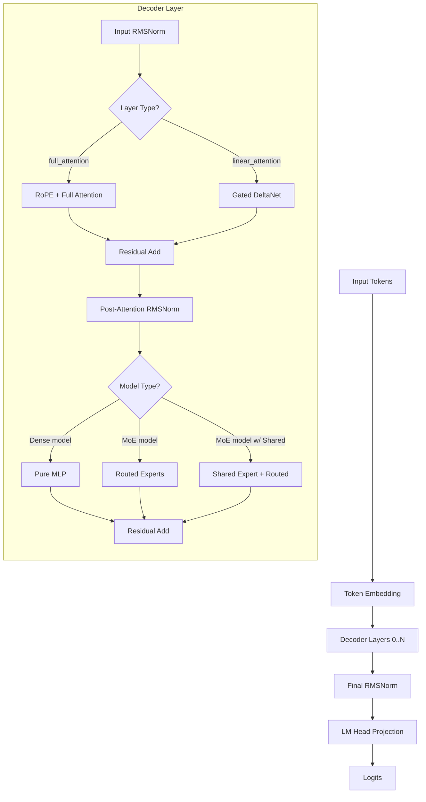

# Qwen3.5 & Qwen3 Next Architecture Guide

This document outlines the architectural structure of the Qwen3.5 and Qwen3 Next models, detailing their hybrid attention mechanisms, Mixture-of-Experts (MoE) integration, and critical implementation differences that must be handled when deploying these models in `vllm.rs`.

## 1. Architectural Overview

Both Qwen3.5 and Qwen3 Next utilize a highly complex **Hybrid Architecture**. The models dynamically interleave standard Full Attention layers with Linear Attention (GatedDeltaNet/Mamba) layers. Additionally, they support both Dense (pure MLP) and Mixture-of-Experts (MoE) feed-forward blocks.

### Layer Execution Workflow

---

## 2. Attention Mechanisms (Full vs. Linear)

The configuration file defines an array `layer_types` (e.g., `["full_attention", "linear_attention", ...]`). `vllm.rs` parses this to instantiate either `Attention` or `GatedDeltaNet` modules dynamically.

### Linear Attention (GatedDeltaNet)
The Linear Attention layer (DeltaNet) replaces the standard KV cache with a recurrent **MambaCache** state. The forward pipeline consists of three phases:
1. **Input Projection**: Projects the hidden states into Query (Q), Key (K), Value (V), Gate (Z), and Gating parameters (B, A).
2. **Core Attention**: Executes the `gdn` (Gated DeltaNet) custom CUDA/Metal kernels (1D Convolution + Radix Linear Attention).
3. **Output Projection**: Applies a Gated RMSNorm scaled by `Z`, followed by a final linear projection.

### Difference #1: Input Projections (Split vs Fused)
There is a fundamental difference in how Qwen3.5 and Qwen3 Next store their projection weights:

- **Qwen3.5**: Uses **Split/Isolated Projections**
  - Checkpoints contain independent weight tensors: `in_proj_qkv`, `in_proj_z`, `in_proj_b` (or `in_proj_ba`), and `in_proj_a`.
  - The `deltanet.rs` implementation resolves these into `GdnProjection::SplitQkvZa`.
  
- **Qwen3 Next**: Uses **Fused Projections**
  - Checkpoints combine the tensors to reduce parameter overhead into two master weights: `in_proj_qkvz` and `in_proj_ba`.
  - The `deltanet.rs` implementation resolves these into `GdnProjection::FusedQkvzBa` and manually unwraps the concatenated dimensions during the forward pass.

---

## 3. Gated RMSNorm and Dimension Grouping (Critical Concept)

At the end of the DeltaNet core attention, the output is passed through a Gated RMSNorm (`gdn::gated_rmsnorm_silu_mul`). This operation enforces normalization statistics (mean/variance) **per attention head** rather than across the entire hidden dimension.

### Difference #2: RMSNorm Scaling Weight Shapes
While the mathematical grouping (`group_size = head_v_dim`) is identical across architectures, the scaling weights physically stored in the HuggingFace checkpoints are completely different.

- **Qwen3 Next**:
  - The `norm.weight` parameter maps exclusively to a single head's dimension: `[head_v_dim]`.
  - The CUDA kernel scales every consecutive attention head by broadcasting this exact same localized weight.
- **Qwen3.5**:
  - The `norm.weight` parameter spans the entire value dimension: `[num_v_heads_global * head_v_dim]`.
  - This grants every individual attention head its own unique and independent scaling vector. 
  - *Implementation gotcha*: Even though the weight maps to `value_dim_global`, the mathematical standard deviation grouping must still be strictly clamped to `head_v_dim`.

*Note: `vllm.rs` automatically partitions `value_dim_global` using `rank * value_dim` offsets to guarantee correct localized shards during Tensor Parallelism.*

---

## 4. Multi-Layer Perceptron (Dense vs MoE)

Both architectures support standard Dense inference and Sparse Mixture-of-Experts (MoE) routing.

### Difference #3: Shared Experts and `intermediate_size`
MoE configurations introduce extreme discrepancies between models regarding their intermediate (hidden width) sizes. 

- **Qwen3 Next MoE**:
  - Employs routing experts **and** a Shared Expert network.
  - The shared expert size is mandated by `moe_cfg.shared_expert_intermediate_size`.
- **Qwen3.5 MoE**:
  - Employs routed experts but completely lacks a Shared Expert network.
  - As a sentinel flag to indicate "No Shared Expert", the configuration explicitly overrides `moe_cfg.shared_expert_intermediate_size = 0`.
  - Furthermore, Qwen3.5 MoE completely drops the root `config.intermediate_size` property (Rust evaluates it internally as `0`).

**Implementation Safety**: If `config.intermediate_size` evaluates to `0`, `vllm.rs` must manually verify the layer context. It isolates fallback logic deep within `qwen3_moe.rs` and `qwen3_5_moe.rs` to pull from `moe_cfg.moe_intermediate_size`. This avoids instantiating ghost MLP modules that would otherwise allocate zero-dimension uninitialized weights.

---

## Direct Comparison Summary Matrix

| Feature | Qwen3.5 | Qwen3 Next |
| :--- | :--- | :--- |
| **Architecture Base** | Hybrid (Full + GDN) | Hybrid (Full + GDN) |
| **GDN Input Projections** | `SplitQkvZa` (Independent blocks) | `FusedQkvzBa` (Concatenated chunks) |
| **RMSNorm Weights Shape** | `[num_v_heads * head_v_dim]` (Distinct) | `[head_v_dim]` (Broadcasted) |
| **RMSNorm Math Grouping** | `head_v_dim` | `head_v_dim` |
| **MoE Routing** | Routed Experts Only | Routed Experts + Shared Expert |
| **Missing MoE Config Sizes** | Sentinels explicitly use `0` to kill Shared layers | Fully populated configurations |
